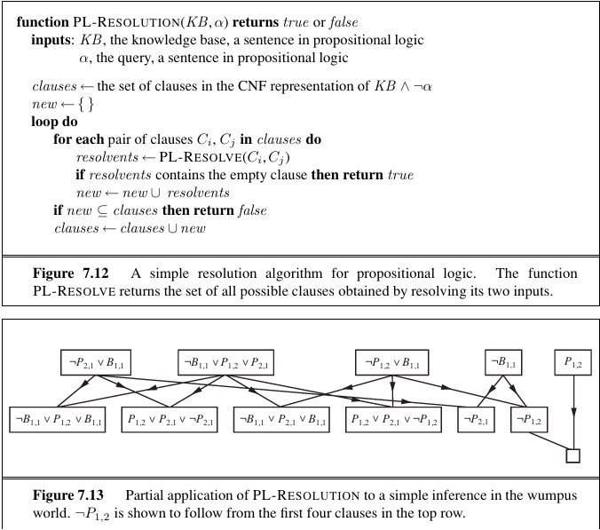

# HCMUS AI FUNDAMENTAL: LAB 2 - LOGIC
For better understanding and detailed explanations, my report is [here](doc/Report.pdf).


## Problem Introduction:

This lab requires resolution in propositional logic, given a Knowledge Base (KB) and a sentence $\alpha$, both expressed in propositional logic and normalized in Conjunctive Normal Form (CNF). The task is to determine whether $\texttt{KB} \vDash \alpha$ (i.e., KB entails $\alpha$) using the **Resolution** algorithm.

### Input
The input consists of KB and $\alpha$ in CNF format, stored in a file named `input.txt` with the following structure:
- The first line contains the sentence $\alpha$.
- The second line contains an integer $N$ – the number of clauses in the KB.
- The next $N$ lines represent the clauses in KB, one clause per line.

For example, this is a simple input:

```bash
-A 
4 
-A OR B 
B OR -C 
A OR -B OR C 
-B

```

### Output
The output includes the set of clauses generated during the resolution process and the final conclusion, stored in a file named `output.txt` with the following structure:
- The first line contains an integer $M_1$ – the number of clauses generated in the first iteration. The next $M_1$ lines list the generated clauses (including the empty clause, if applicable), one clause per line. The empty clause is represented by `{}`.
- Subsequent iterations are represented similarly, with $M_2$, $M_3$, ..., $M_n$ clauses generated in each iteration.
- The final line states the conclusion, answering whether “KB entails $\alpha$.” Print `YES` if KB entails $\alpha`, otherwise print `NO`.
- Duplicate clauses (within the same iteration, the initial KB, or previous iterations) are ignored.

For example, this will be the output for the input above:
```bash
3
-A
B
-C
4
-B OR C
A OR C
A OR -B
{}
YES
```

### Notes
- Positive literals are represented by uppercase single characters (`A`-`Z`). Negative literals are represented by a minus sign (`-`) immediately preceding the character.
- The keyword `OR` connects literals within a clause. There may be one or more spaces between literals and the `OR` keyword.

## Algorithm
The **Propositional Logic Resolution** algorithm works as follows:

1. **Negate the Target Statement**:
   - Convert the negation of the target statement (α) into Conjunctive Normal Form (CNF).

2. **Initialize the Knowledge Base (KB)**:
   - Add all negated target clauses to the KB if they don't already exist.

3. **Resolution Loop**:
   - Generate all pairs of clauses from the current KB.
   - For each pair of clauses, apply the resolution rule:
     1. Find complementary literals between the two clauses.
     2. Combine the remaining literals of both clauses into a **resolvent**.
     3. Simplify and standardize the resolvent (e.g., sort literals, remove duplicates).
     4. Check for contradictions (e.g., if the resolvent contains both a literal and its negation).
     5. If the resolvent is empty (`{}`), the proof is complete.
   - Add all new resolvents to the KB, ensuring no duplicates or redundancies.

4. **Termination**:
   - If the empty clause (`{}`) is generated, the target is entailed by the KB (**output YES**).
   - If no new clauses can be generated, the target is not entailed by the KB (**output NO**).

5. **Return the Proof Steps and Result**:
   - Maintain a list of all generated clauses and the reasoning steps for debugging or explanation.

Here's the pseudo code and one of the practical applications of the algorithm:



## Installation

To run this project, follow the steps below to set up the environment and install the necessary dependencies.

### Prerequisites

Ensure that you have the following installed:

- **Python 3.5 or higher** (Check with `python --version` or `python3 --version`).
- **Pip** (Python's package installer).

### 1. Clone the Repository

```bash
git clone https://github.com/PrORain-HCMUS/Lab2-AI-Fundamental
cd https://github.com/PrORain-HCMUS/Lab2-AI-Fundamental
```

### 2. Install essential dependencies from `requirements.txt`:

```bash
pip install -r requirements.txt
```

### 3. Verify Tkinter Installation (if needed)

**Tkinter** is a standard library included with Python for versions 3.x, so you typically do not need to install it separately.

However, if you're using a minimal Python installation (e.g., on Linux), you may need to install it manually.

#### For Ubuntu/Debian-based Linux distributions:
If you're using a Linux distribution like Ubuntu or Debian, you can install Tkinter with the following command:

```bash
sudo apt-get install python3-tk
```

### 4. Running the Application
Once the dependencies are installed, you can run the program using the these command consecutively:
```bash
python KnowledgeBase.py
python PL_Resolution.py
python PL_GUI.py
```