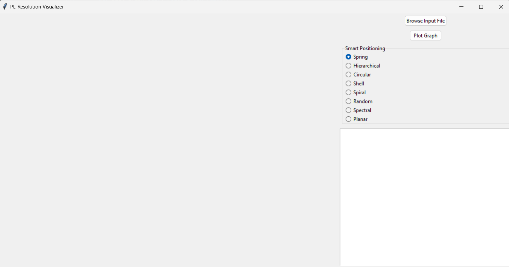
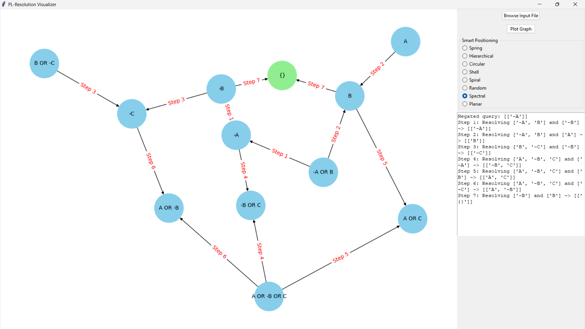
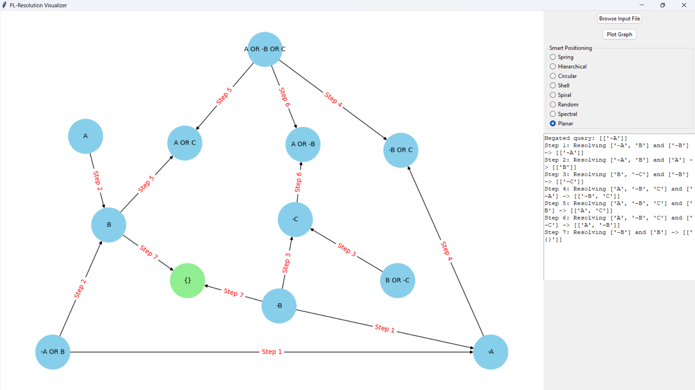

# HCMUS AI FUNDAMENTAL: LAB 2 - LOGIC
For better understanding and detailed explanations, my report is [here](doc/Report.pdf).


## Problem Introduction:

This lab requires resolution in propositional logic, given a Knowledge Base (KB) and a sentence $\alpha$, both expressed in propositional logic and normalized in Conjunctive Normal Form (CNF). The task is to determine whether $\texttt{KB} \vDash \alpha$ (i.e., KB entails $\alpha$) using the **Resolution** algorithm.

### Input
The input consists of KB and $\alpha$ in CNF format, stored in a file named `input.txt` with the following structure:
- The first line contains the sentence $\alpha$.
- The second line contains an integer $N$ – the number of clauses in the KB.
- The next $N$ lines represent the clauses in KB, one clause per line.

For example, this is a simple input:

```bash
-A 
4 
-A OR B 
B OR -C 
A OR -B OR C 
-B

```

### Output
The output includes the set of clauses generated during the resolution process and the final conclusion, stored in a file named `output.txt` with the following structure:
- The first line contains an integer $M_1$ – the number of clauses generated in the first iteration. The next $M_1$ lines list the generated clauses (including the empty clause, if applicable), one clause per line. The empty clause is represented by `{}`.
- Subsequent iterations are represented similarly, with $M_2$, $M_3$, ..., $M_n$ clauses generated in each iteration.
- The final line states the conclusion, answering whether “KB entails $\alpha$.” Print `YES` if KB entails $\alpha`, otherwise print `NO`.
- Duplicate clauses (within the same iteration, the initial KB, or previous iterations) are ignored.

For example, this will be the output for the input above:
```bash
3
-A
B
-C
4
-B OR C
A OR C
A OR -B
{}
YES
```

### Notes
- Positive literals are represented by uppercase single characters (`A`-`Z`). Negative literals are represented by a minus sign (`-`) immediately preceding the character.
- The keyword `OR` connects literals within a clause. There may be one or more spaces between literals and the `OR` keyword.

## Algorithm
The **Propositional Logic Resolution** algorithm works as follows:

1. **Negate the Target Statement**:
   - Convert the negation of the target statement (α) into Conjunctive Normal Form (CNF).

2. **Initialize the Knowledge Base (KB)**:
   - Add all negated target clauses to the KB if they don't already exist.

3. **Resolution Loop**:
   - Generate all pairs of clauses from the current KB.
   - For each pair of clauses, apply the resolution rule:
     1. Find complementary literals between the two clauses.
     2. Combine the remaining literals of both clauses into a **resolvent**.
     3. Simplify and standardize the resolvent (e.g., sort literals, remove duplicates).
     4. Check for contradictions (e.g., if the resolvent contains both a literal and its negation).
     5. If the resolvent is empty (`{}`), the proof is complete.
   - Add all new resolvents to the KB, ensuring no duplicates or redundancies.

4. **Termination**:
   - If the empty clause (`{}`) is generated, the target is entailed by the KB (**output YES**).
   - If no new clauses can be generated, the target is not entailed by the KB (**output NO**).

5. **Return the Proof Steps and Result**:
   - Maintain a list of all generated clauses and the reasoning steps for debugging or explanation.

Here's the pseudo code and one of the practical applications of the algorithm:


## Advanced (or Additional) features
In the spirit of thinking out of the box, and in order to gain a better overview at this Lab, I have also prepared some adđitional features as shown below

### Real-problem Input
So basically I've transformed some iconic, or at least well-known logic problems that can be solved by Propositional Logic into CNF and hoped my algorithm could figure out a way to complete them. And fortunately it did! 

For example, this is the **Wolf-Goat-Cabbage River Crossing Riddle**, a classic problem from the 9th century. The problem is stated as follows:

```bash
A farmer wants to cross a river with a wolf, a goat, and a cabbage. The farmer has a small boat that 
can carry himself along with only one of the three items: the wolf, the goat, or the cabbage. The challenge lies in ensuring that:

- If the wolf and the goat are left together on a riverbank, the wolf will eat the goat.
- If the goat and the cabbage are left together on a riverbank, the goat will eat the cabbage.

The task is to find a way for the farmer to transport the wolf, the goat, and the cabbage across the river safely.

```
Here's how I tranform the problem above into CNF:
```bash
T                              # T represents the state where "the farmer and all items have successfully crossed the river" (True)
9 
-W OR -G OR F                  # The wolf (-W) and the goat (-G) are not both on the starting bank unless the farmer (F) is also there.
-G OR -C OR F                  # The goat (-G) and the cabbage (-C) are not both on the starting bank unless the farmer (F) is also there.
F OR -W                        # Either the farmer (F) is on the starting bank or the wolf (-W) is not on the starting bank.
F OR -G                        # Either the farmer (F) is on the starting bank or the goat (-G) is not on the starting bank.
F OR -C                        # Either the farmer (F) is on the starting bank or the cabbage (-C) is not on the starting bank.
W OR G OR C                    # Either the wolf (W), the goat (G), or the cabbage (C) has crossed the river.
-F OR -W OR -G OR -C OR T      # Either the farmer (-F) is on the opposite bank, or the wolf (-W), the goat (-G), and the cabbage (-C) are not on the starting bank, or the success state (T) is reached.
T OR F                         # Either the success state (T) is reached or the farmer (F) is on the starting bank.
T OR W                         # Either the success state (T) is reached or the wolf (W) has crossed the river.
T OR G                         # Either the success state (T) is reached or the goat (G) has crossed the river.
T OR C                         # Either the success state (T) is reached or the cabbage (C) has crossed the river.

```

### GUI (Graphical User Interface)

For better visualization of problems in PL Resolution, I also developed a GUI that allows users to plot graphs from inputs, manipulate any movements with the graphs and so on.  

#### Main Components of the Workspace
In the workspace window, you can observe three main components:

1. **Graph Visualization**  
   Displays the resolution graph, allowing the user to visualize the logical steps of the resolution process.

2. **Text Log**  
   Shows the detailed resolution steps, providing insight and updates on the progress of the resolution.

3. **Tools**  
   The tools section includes three sub-components:
   - **Browse Input File**  
     Allows the user to browse and select the input file for loading the knowledge base and query.
   - **Plot Graph**  
     Generates the resolution graph for visualization.
   - **Smart Positioning**  
     Enables intelligent positioning of the graph nodes for a clearer and more organized layout.

#### Features
1. **Select Input File**  
   Allows the user to choose a text file from the system to load the knowledge base and query. This feature is represented by the method: `browse_file`.

2. **Read Knowledge Base**  
   Reads and analyzes the statements from the selected file, initializing the `KnowledgeBase` object. This feature is represented by the method: `read_knowledge_base`.

3. **Draw Resolution Graph**  
   Draws a graph representing the resolution steps, using the `networkx` and `matplotlib` libraries. This feature is represented by the method: `plot_graph`.

4. **Update Graph Layout**  
   Updates the graph layout when changed, allowing users to select different graph display types. This feature is represented by the method: `update_layout`.

5. **Node Positioning and Movement**  
   Returns the positions of nodes in the graph according to the selected layout.  
   - Handles mouse click events to select nodes in the graph, represented by the method: `on_click`.  
   - Handles mouse drag events to move nodes in the graph, represented by the method: `on_motion`.  
   - Handles mouse release events to complete the drag-and-drop action for nodes, represented by the method: `on_release`.

6. **Display Resolution Steps**  
   Displays the resolution steps in a `Text` widget, providing detailed information to the user. This feature is represented by the method: `steps_text`.

7. **Draw Graph on Canvas**  
   Draws the graph on the main canvas in the application window, allowing interaction with the graph. This feature is represented by the method: `canvas`.


### Smart Positioning and Layout Options

In addition to manually adjusting the graph nodes using drag-and-drop actions, a notable feature has been added to enhance the user's experience: **Smart Positioning**. This feature automatically generates the graph using different layouts, making it easier to visualize and follow the resolution process. The available layouts are:

```bash
- **Spring**: A spring layout where nodes push/pull each other as if connected by springs.
- **Hierarchical**: A hierarchical layout that organizes nodes in a tree-like structure.
- **Circular**: A circular layout where nodes are arranged in a circular formation.
- **Shell**: A shell layout where nodes are arranged in concentric layers.
- **Spiral**: A spiral layout where nodes are positioned in a spiral pattern.
- **Random**: A random layout where nodes are placed randomly.
- **Spectral**: A spectral layout that uses the eigenvectors of the Laplacian matrix for node placement.
- **Planar**: A planar layout that attempts to draw the graph without any edge crossings if possible.

```

Initially, after browsing an input file and plotting the graph, the graph is automatically generated using the **Spring layout**. However, this does not always result in a clear, readable graph, as nodes, edges, and labels may overlap. To improve visualization, alternative layouts are provided to better organize the graph.

Below are two images illustrating how different layouts can make the graph more readable by ensuring that edges do not intersect. (Note: Manual adjustments may still be necessary to further space out the nodes.)





## Installation

To run this project, follow the steps below to set up the environment and install the necessary dependencies.

### Prerequisites

Ensure that you have the following installed:

- **Python 3.5 or higher** (Check with `python --version` or `python3 --version`).
- **Pip** (Python's package installer).

### 1. Clone the Repository

```bash
git clone https://github.com/PrORain-HCMUS/Lab2-AI-Fundamental
cd https://github.com/PrORain-HCMUS/Lab2-AI-Fundamental
```

### 2. Install essential dependencies from `requirements.txt`:

```bash
pip install -r requirements.txt
```

### 3. Verify Tkinter Installation (if needed)

**Tkinter** is a standard library included with Python for versions 3.x, so you typically do not need to install it separately.

However, if you're using a minimal Python installation (e.g., on Linux), you may need to install it manually.

#### For Ubuntu/Debian-based Linux distributions:
If you're using a Linux distribution like Ubuntu or Debian, you can install Tkinter with the following command:

```bash
sudo apt-get install python3-tk
```

### 4. Running the Application
Once the dependencies are installed, you can run the program using the these command consecutively:
```bash
python KnowledgeBase.py
python PL_Resolution.py
python PL_GUI.py
```